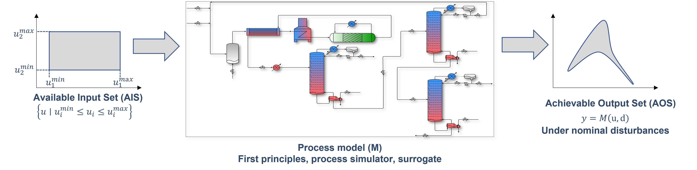

Process Operability Overview
============================

What is process operability?
----------------------------

The underlying problem: Design and control
~~~~~~~~~~~~~~~~~~~~~~~~~~~~~~~~~~~~~~~~~~
This question must be properly assessed before
diving into the nitty gritty details that involve
operability analysis.

When designing a chemical process/plant, two main tasks
naturally arise, when bearing in mind the processing of 
raw materials into value-added products such as chemicals
or energy:

#.	**Process design**: Which decisions should be
	made with respect to the design variables of this process,
	in a way that the overall objectives of the process are
	achieved (economic profitability, constraints related to
	product purity/pollutant emissions, etc.)?

#.	**Control objectives assessment**: Which variables
	should be controlled, yielding the maximum operability of this process?
	That is, the process can "reach" its maximum capacity, given the 
	ranges of the manipulated/input variables?

Classically, tasks 1 and 2 were performed in a sequential approach:
Firstly, an engineer/practitioner would come up with the design decisions, 
and only then the control objectives are assessed. Unfortunately, this can 
yield a process that is designed in a way that its operability capabilities
are severely mitigated. In other words, because the control objectives were
not considered early in the design phase, the process itself might be not
controlled or operable at all. To give you perspective or how challenging this
problem is, there are reports dating back to the 40's from Ziegler and Nichols :cite:`ziegler1943process`
(The same ones from the controller tuning laws) stressing out about this problem,
mentioning the importance of interconnecting design and control.

With this in mind, the need of quantifying achievability of a general nonlinear
process also naturally arises. The looming question: "Can one quantify achievability
of process design and control objectives simultaneously?" was the underlying motivation
for Prof. Christos Georgakis and his collaborators to formally define **process operability**
and define a metric called the **Operability Index**.

.. IMPORTANT::
	Process operability is a systematic framework to simultaneously assess
	design and control objectives early in the conceptual phase of industrial,
	typically large-scale, and nonlinear chemical processes.

test

   AIS-AOS relationship via Process Model (M)

.. IMPORTANT::
	Important concept example.

